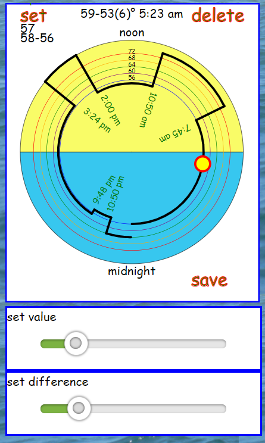

# @mckennatim/react-zonetimer

A custom package used by iot.sitebuilt.net to create a mobile freindly SVG react component that can create and modify a 24 hour schedule. The schedule that is input and output is in a minimalist format suitable for transmitting to and from an iot.sitebuilt.net device. 

## iot.sitebuilt.net devices

IOT devices typically contain sensors and relays. `esp8266` and `esp32` devices also have builtin WIFI and multiple timers. 

`iot.sitebuilt.net (sbiot)` devices communicate over a lightweight protocal called `mqtt`. One of its internal timers is set to go off every 24 hours sometime after midnight (device time) at which point the clock is reset and that days schedule is downloaded to the device for each of the sensors and relays that are scheduled.

The `sbiot` devices sets up whatever timers are needed to execute the days schedule for all of its schedules sensors and relays. If the device loses contact with the server it will continue to run that schedule or a default schedule until contact is reestablished.

Schedules are typically of two types. On is binary, like a light timer or sprinkler timer, instructing when a devices relay should go on and when it should go off. The other is analog, where the device is given an instruction on what setting of a sensor triggers some action on the device. Typically the `sbiot` device monitors its environment, comparing what it senses to the current period's `hilimit` and `lolimit` values triggering some action depending on how the reading compares to the limits. Examples would include thermostats, or humidity controls.

Any of the daily schedules runing on the `sbiot` device can be modified by authorized users. The `ZoneTime` component eases the process of setting up a day's schedule for one scheduled sensor/relay for an `sbiot` device

## usage

    npm install @mckennatim/react-zonetimer

    import{ZoneTimer} from '@mckennatim/react-zonetimer'
    
in parent component
    
    const sched = [[0,0,58,56], [6,20,69,67], [8,30,64,62], [17,40,68,66], [23,0,58,56]] 
    const sunrise = "06:18"
    const sunset = "19:24"  
    const setNewSched=(newsched)=>()=>{
      console.log('newsched: ', newsched)
    } 

    <ZoneTimer 
      asched={sched}
      range={[55,75]}
      dif={2} //optional: for when using analog component
      difrange={12} //optional: for when using analog component
      templines={[
        {v:72,c:'red'}, 
        {v:68, c:'orange'},
        {v:64, c:'green'},  
        {v:60, c:'purple'}, 
        {v:56, c:'blue'}]}
      sunrise={sunrise} 
      sunset={sunset} 
      retNewSched={setNewSched}
    />

## operation
The size of the handle and location of the buttons were chosen to optimize the touch usability of the component. The same component works for both binary and analog applications. 

### capture the handle
There is a small filled circle that is the handle for operating this control. You can tell when you have successfully touched or clicked on the handle because the background changes from white to yellow. Once you have captured the handle you can rotate it through the schedule path which is indicated by a heavy black line. Notice the readout at the center top of the control which indicates the relay state or hilimit/lolimit at a particular time.

### (set/finish) insert a new interval

To add an event or interval to the schedule

1. * for binary - adjust the `set value slider` for the value you want in the new interval
   * for analog - adjust the `set value slider` for the center value you want in the new interval then adjust then adjust the `set difference slider` to set the hilimit and lolimit around that center value. 
2. Touch `set` in the upper right corner to create a new interval that is about 20 minutes long. Capture the handle again and rotate it counter clockwise til you reach your desired stop time. Click `finish` in the upper left to complete the insertion of the new interval

### delete an event
Capture the handle and rotate it to a time within the interval you want to delete and hit `delete`

### save and return
pressing `save` calls `props.retNewSched(newsched)` with the current modified schedule.

## props

### asched 
The format of the device schedule is used to determine whether a binary or an analog control is rendered. It is contained in the prop `asched` and is the inital schedule sent to the component. This is the format that `sbiot devices` uses to store the schedule for a sensor or relay on the device for the current day and to store other day's sensor/relay device schedules from a database on `iot.sitebult.net`. It is a 2 dimesional array typically in one of two formats 

analog 

    [[0,0,59,53],[7,45,79,71],[10,50,56,52],[17,45,66,64],[22,50,61,59]]

where each subarray is of the form `[hr, min, hilimit, lolimit]` 

or binary

    [[0,0,0], [6,20,1], [8,30,0], [17,40,1], [23,0,0]]

where each subarray is of the form `[hr, min, val]` Hours are in 24 hour format.

### range 

An array defining the maximum and minimum values of a devices schedule

### dif (optional)
The default difference between hilimit and lolimit for using as an anlog control

### difrange (optional)
The maximum value of the `set difference slider` that appears when an analog control is called for. The range of the slider is min=1, max=`difrange`

### templines

An array of objects that causes a set of concentric circles to be drawn on the component. These circles serve as intermediary indicators over the range of setting values

### sunrise and sunset

A string in the format `15:20` provided by device through the `useDevSpecs` function of `@mckennatim/mqtt-hooks package. One of the objects it returns is labeled `binf`. `binf.locdata` provides information on device location including address, lat, lng, timezone, sunrise and sunset.

### retNewSched

`retNewSched` is a function prop that sends back the modified or new schedule for `ZoneTimer`. Upon completion of a schedule, pressing the `save` button on the SVG component returns the modified schedule to the parent component. The parent component would typically then send the modified schedule to the device or use the modified schedule to update the database for other day's schedules.

## refs
http://apex.infogridpacific.com/SVG/svg-tutorial-lesson17-path-arcs.html

https://github.com/mckennatim/mqtt-hooks

https://github.com/tranbathanhtung/usePosition

https://til.hashrocket.com/posts/hwybnwyfyz-get-a-ref-to-a-dom-element-with-react-hooks